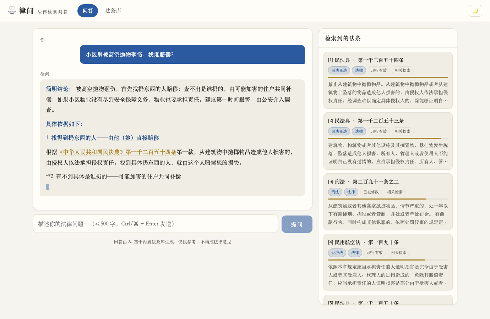

<div align="center">

# ⚖️ LawQ · 律问

**Legal QA grounded in the statutes themselves — transparent retrieval, verifiable citations**

[](LICENSE)
[](https://python.org)
[](https://fastapi.tiangolo.com)
[](https://developers.weixin.qq.com/miniprogram/)
[](https://open.bigmodel.cn)

**Ask a question → retrieve matching articles from 26,000 statutes in force → the LLM answers *only* from what was retrieved → every citation is clickable and verifiable**

中文 · [English](README.en.md)

</div>

---



> The left side streams the generated answer, where citations like 《Civil Code》Art. 1254 are **clickable**; the right panel shows every retrieved article with its relevance score and full text — **each legal basis of the answer can be verified on the spot**.

## Why this project

Asking an LLM legal questions has two failure modes: **hallucinated citations** (the model invents statute numbers or cites repealed versions from memory) and **opaque grounding** (you can't check what it based the answer on).

LawQ's answer: make retrieval an **open book**—

| | Ordinary legal LLM | LawQ |
|---|---|---|
| Legal basis | Model memory, unverifiable | Article-level retrieval over a built-in corpus; every hit is displayed |
| Citations | Cannot be checked | 《Law》Art. X links jump to the statute card |
| When retrieval finds nothing | Often fabricates | Prompt-constrained to say "not covered" and refuse |
| Relevance | Black box | Each hit shows a BM25 score bar |

## Features

- 🔍 **Hybrid retrieval**: jieba + BM25, plus exact-article lookup ("what does Civil Code Art. 1254 say"), law-name alias boosting, colloquial synonym expansion ("高空抛物 high-altitude throwing" → "抛掷物品 throwing objects" as the statute actually phrases it), coverage and phrase-match re-ranking. 10/10 on a canonical question test set (`scripts/test_retrieval.py`)
- ✦ **Streaming QA**: SSE streaming; GLM models via OpenAI-compatible API (swap any model with one config line); degrades gracefully to pure retrieval when no API key is set
- 📚 **Statute library**: Constitution + 378 laws in force (~24k articles), browsable by the seven official legal domains; historical versions and amendments are status-tagged
- 📱 **Two clients**: zero-build web app (dark mode, responsive) + native WeChat Mini Program (with a hand-rolled incremental UTF-8 decoder for chunked SSE)
- 🛡 **Production-ready**: password + token auth, per-IP rate limiting, systemd + nginx deployment, one-shot deploy script, ICP-filing & HTTPS handbook

## Quick start

```bash
./start.sh          # venv → build statute corpus → serve → open browser
```

Defaults to <http://127.0.0.1:8790>. For LLM answers, put an API key in `.env` ([Zhipu BigModel](https://open.bigmodel.cn) has a free tier); without a key it still works as a retrieval browser.

> Corpus: built from structured statute data (JSONL with law name / chapter / article number / text / legal domain / status). `python scripts/build_corpus.py your_corpus.jsonl` rebuilds SQLite + the BM25 index in ~5 seconds.

## Retrieval quality example

```
Q: "Someone threw an object off a building and hit me — who pays?"
→ Civil Code Art. 1254 (falling/thrown objects liability)   score 1.28
→ Civil Code Art. 1253 (detached/falling fixtures)           score 1.21
→ Criminal Law Art. 291-2 (crime of high-altitude throwing)  score 1.05

Q: "What counts as justifiable defense?"
→ Criminal Law Art. 20 — top hit
```

"高空抛物" is media language; the statute says "抛掷物品". Pure lexical matching misses this — synonym expansion + phrase re-ranking bridge the **gap between colloquial and legal language** (see the design doc, in Chinese).

## Deployment

Full handbook (Chinese): cloud server (nginx + systemd) → domain + ICP filing → Let's Encrypt HTTPS → WeChat Mini Program review. `deploy/deploy.sh` is a one-shot deploy script.

## Known limits

- Corpus covers the "Constitution + national laws" layer; administrative regulations, local regulations and judicial interpretations are not included (the model is constrained to say so honestly)
- Retrieval is lexical BM25; heavily colloquial queries rely on the synonym table — a Chinese embedding reranker is a natural next step

## License

[MIT](LICENSE)
