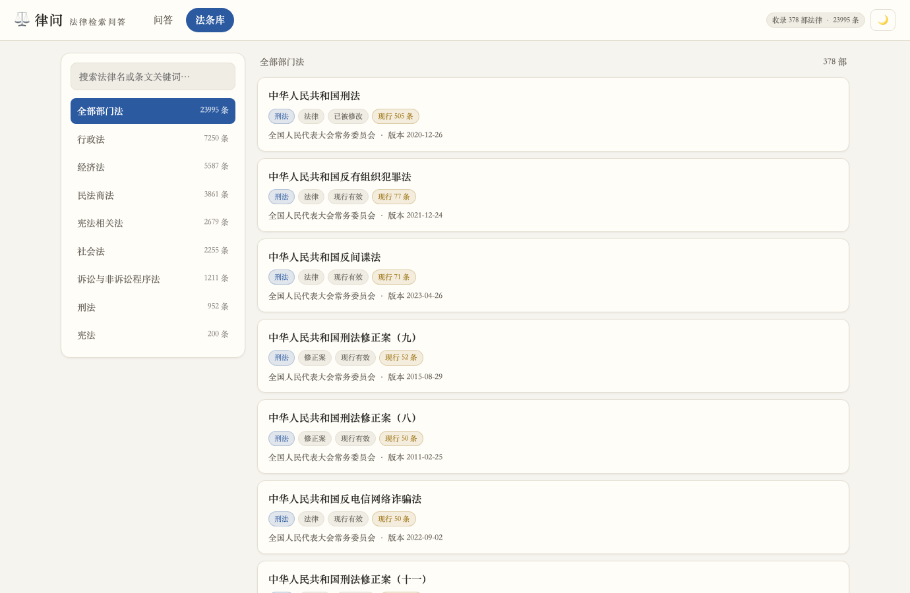
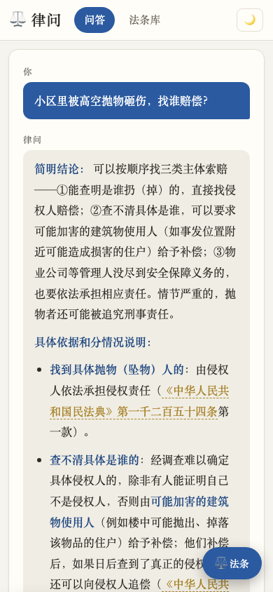

<div align="center">

# ⚖️ 律问 LawQ

**法律检索问答 · 检索透明，引用可溯源**

[](LICENSE)
[](https://python.org)
[](https://fastapi.tiangolo.com)
[](https://developers.weixin.qq.com/miniprogram/)
[](https://open.bigmodel.cn)

**问一个问题 → 在 2.6 万条现行法律中检索命中条文 → 大模型仅依据检索结果作答 → 每条引用可点击核对原文**

[English](README.en.md) · 中文

</div>

---


> 左侧是流式生成的回答，其中《民法典》第1254条这样的引用是**可点击的角标**；右侧面板实时展示检索命中的法条、相关度得分与条文原文——**回答的每一条法律依据都可以当场核对**。

## 为什么做这个项目

直接问大模型法律问题有两个痛点：**引用可能是编造的**（模型凭记忆输出不存在的条文或过时版本），**检索过程不可见**（用户无法核实依据）。

LawQ 的答案：把检索做成**明牌**——

| | 普通法律大模型 | LawQ 律问 |
|---|---|---|
| 法律依据 | 模型记忆，真假难辨 | 内置法条库条级检索，命中条文全部展示 |
| 引用 | 无法验证 | 《法名》第X条点击定位到原文卡片 |
| 检索不到时 | 大概率编一个 | 提示词强制约束"明说未覆盖"，拒绝编造 |
| 相关度 | 黑盒 | 每条命中显示 BM25 得分条 |

## 功能特性

- 🔍 **混合检索**：jieba 分词 + BM25，叠加法条直查（"民法典第1254条说了什么"精确命中）、法名别名加权（民法典/民诉法/消保法…）、口语同义词扩展（"高空抛物"→"抛掷物品"、"酒驾"→"饮酒+机动车"）、查询覆盖率与连续短语重排。10 个典型问题自测全对（`scripts/test_retrieval.py`）
- ✦ **流式问答**：SSE 流式输出；GLM 系列模型（OpenAI 兼容接口，可一行配置换任意模型）；未配置 Key 时自动退化为纯检索模式
- 📚 **法条库浏览**：宪法 + 现行有效法律 378 部、2.4 万条，按七大部门法浏览，历史版本/修正案标注时效
- 📱 **双端**：零构建网页（夜间模式/移动端适配）+ 原生微信小程序（自实现流式 UTF-8 分包解码）
- 🛡 **工程完整**：访问口令 + token 鉴权、每 IP 限流、systemd + nginx 部署、一键部署脚本、备案与 HTTPS 手册

## 快速开始

```bash
./start.sh          # 自动建环境 → 构建法条库 → 启动 → 打开浏览器
```

默认 <http://127.0.0.1:8790>。智能问答需在 `.env` 填入大模型 API Key（[智谱开放平台](https://open.bigmodel.cn)注册即有免费额度）；不填也能用，回答退化为法条原文展示。

> 法条语料：使用结构化法律条文数据（JSONL，含法律名/章节/条号/条文/部门法/时效状态）构建。`python scripts/build_corpus.py 你的语料.jsonl` 一条命令重建 SQLite + BM25 索引（约 5 秒）。

## 项目结构

```
├── app/                  # FastAPI 后端
│   ├── main.py           #   路由：/api/ask(SSE) /api/laws /api/search /api/login …
│   ├── retrieval.py      #   BM25 检索 + 法条直查 + 同义词/短语重排
│   ├── llm.py            #   OpenAI 兼容接口流式调用 + 提示词
│   ├── auth.py           #   口令 → HMAC token（7天）
│   ├── ratelimit.py      #   滑动窗口限流
│   └── database.py       #   SQLite 只读层
├── web/                  # 网页前端（零构建单页）
├── miniprogram/          # 微信小程序（原生开发）
├── scripts/
│   ├── build_corpus.py   # 语料 JSONL → SQLite + BM25 索引
│   ├── test_retrieval.py # 检索自测（10 个典型问题）
│   └── take_screenshots.py
├── deploy/               # nginx / systemd / 一键部署脚本
├── PRD.md / 技术设计.md / 部署手册.md
└── screenshots/          # 运行截图
```

## 界面一览

| 问答与引用核对 | 法条库浏览 | 移动端 |
|---|---|---|
|  |  |  |

## 检索质量示例

```
问："小区里被高空抛物砸伤，找谁赔偿？"
→ 民法典 第1254条（建筑物抛掷坠落责任）   score 1.28
→ 民法典 第1253条（搁置物悬挂物脱落）     score 1.21
→ 刑法   第291条之二（高空抛物罪）        score 1.05

问："什么情况属于正当防卫？"
→ 刑法 第20条（正当防卫）  精确/高分命中
```

"高空抛物"是媒体用语，法条原文写的是"抛掷物品"——纯词面匹配会检索不到。同义词扩展 + 短语重排解决这类**口语与法言法语的鸿沟**，详见[技术设计](技术设计.md)。

## 部署上线

见 **[部署手册.md](部署手册.md)**：云服务器（nginx + systemd）→ 域名 + ICP 备案 → Let's Encrypt HTTPS → 微信小程序提审，全流程手册。`deploy/deploy.sh` 一键部署。

## 已知边界

- 语料覆盖"宪法 + 法律"层，不含行政法规/地方性法规/司法解释（模型会被约束如实说明）
- 检索为 BM25 词面模型；极口语化问题依赖同义词表，后续可加中文向量检索混合排序

## License

[MIT](LICENSE)
